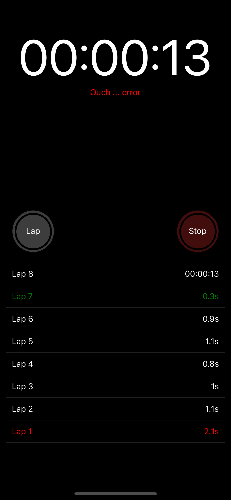

# Programming test

- For a senior role, I had to perform the following assessment as part of a programming test. The goal was to re-create the Apple StopWatch App. 
- Extra constraint: I had 2 hours to complete the entire test.
- Room for improvement: split the timer HH:mm:ss, use Flatlist, memoize <Laps/>, use RAF to keep UI frames in sync.

    

# Stopwatch

Create a "Stopwatch" app from scratch and lightning fast. The goal is to develop an app able to run on iOS and Android.

You might face some difficulties during the development. Do not panic. Make up your mind and take some opinionated decisions. It is just an opportunity to show a bunch of different technical skills.

## Guidelines

- Create a fresh app called "Stopwatch".
- Create a reusable hook called "useStopwatch" to encapsulate the whole logic.
- Create a component called "Stopwatch" with a layout similar to the provided snapshots.
- Collect the slowest and fastest laps of each execution and post them to the endpoint: `http://fast-and-furious.io/laps`, if the request fails, show a visual error message `Ouch ... [error message]`.
- For styling purposes it is only allowed to use [`@emotion/native`](https://emotion.sh/docs/@emotion/native).
- Do you want to use externals libraries? Review the library and write down the assertions made.
- Timing: even the reduced scope of this app, it is not possible to standardise the time that it will require to each individual developer, as it varies depending the many factors reached by the exersise, your former preparation and know-how. In a lucky day, probably you will finish it within the day, at most it might require an extra day.
- It is not finished until it is not done! Exchange ideas with your colleagues but write your own version.

## Escape Hatchs

- Are you stuck? Find a "tutor" for advice, apply the provided hints and move forward, the stopwatch is running.
- If you have problems running the environment, use a playground (e.g., [snack](https://snack.expo.dev/)).
- Do you remember how to create a custom hook? Already presented in our Front-end bootcamp (i.e., [Counter](https://codesandbox.io/s/bootcamp-5e312?initialpath=/gems/1), [Countdown](https://codesandbox.io/s/bootcamp-5e312?initialpath=/gems/2)).
- Are you short on time? Try reducing functionatity (e.g., just start/stop/reset, mock a list of laps, look & feel, lifesavers `TODO` and `FIXME`).
- Is it "too big to fail"? Find a buddy for pair programming or to split the tasks.

## Notes

### Sizes

- top container (timer value): 50% app height
- bottom container (controls + laps): 50% app height
- timer: font-size 84px
- controls: width 72px, border-width 2px

### Colors

- app: background #000
- start: color #50d137, background #1b361f
- stop: color #ef4f4d, background #420e0d
- lap: color #fff, background #3d3d3d
- reset: color #fff, background #3d3d3d
- rows' separator: color #202020
